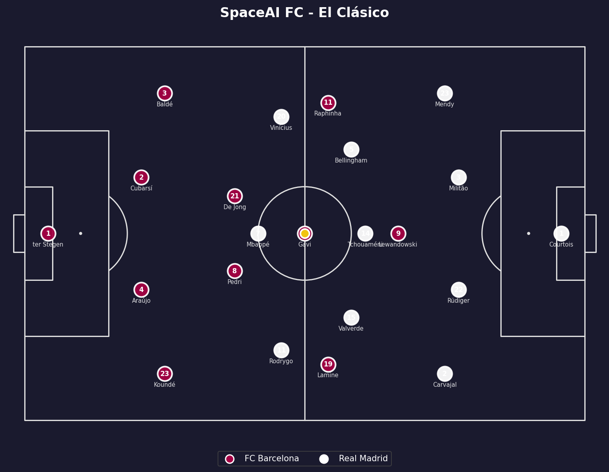
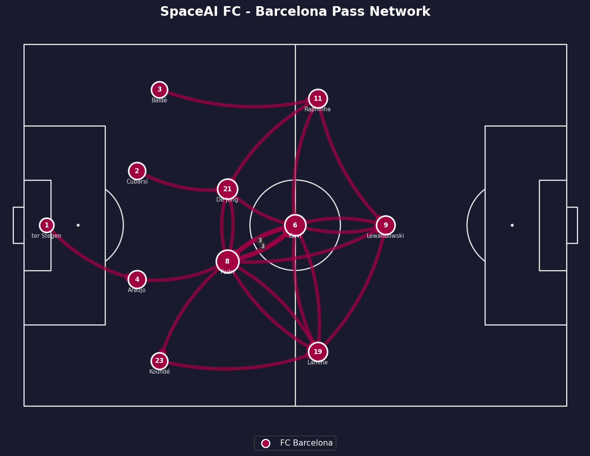
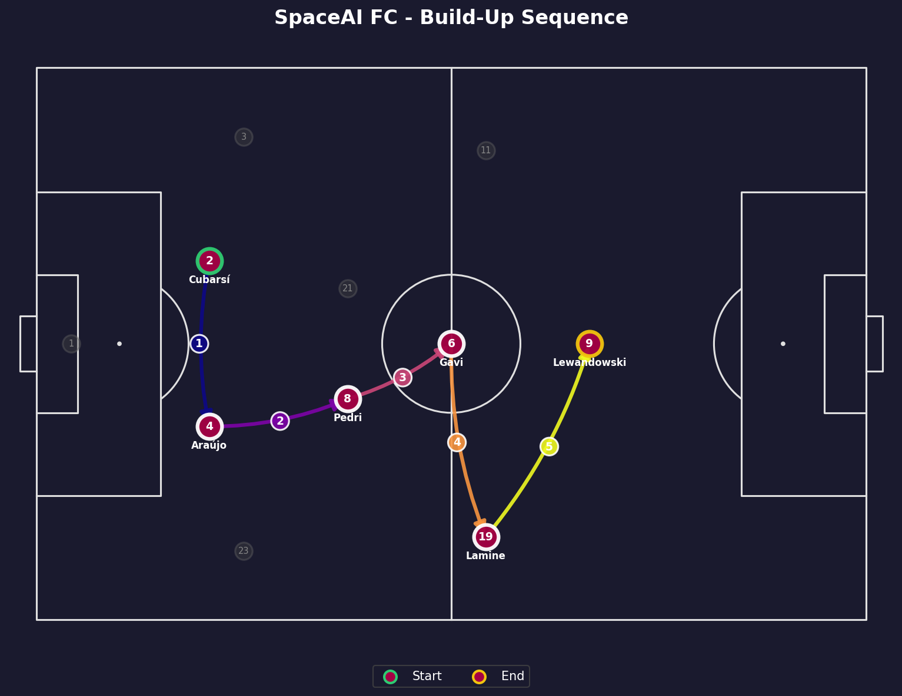
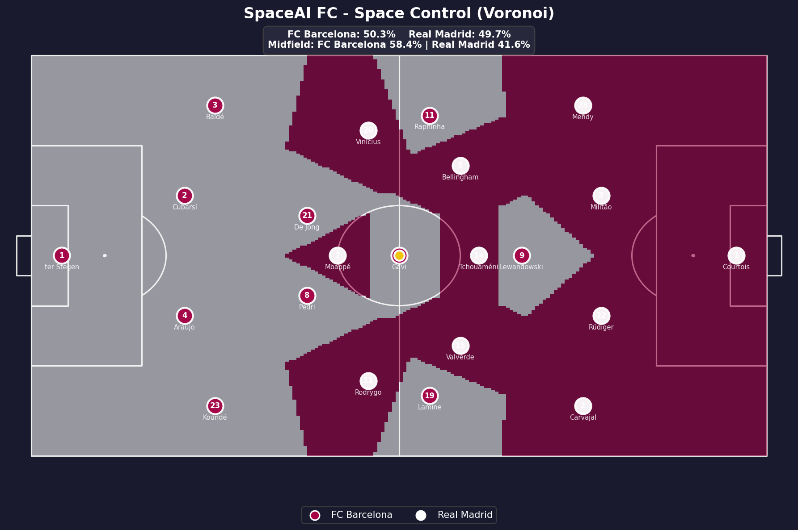
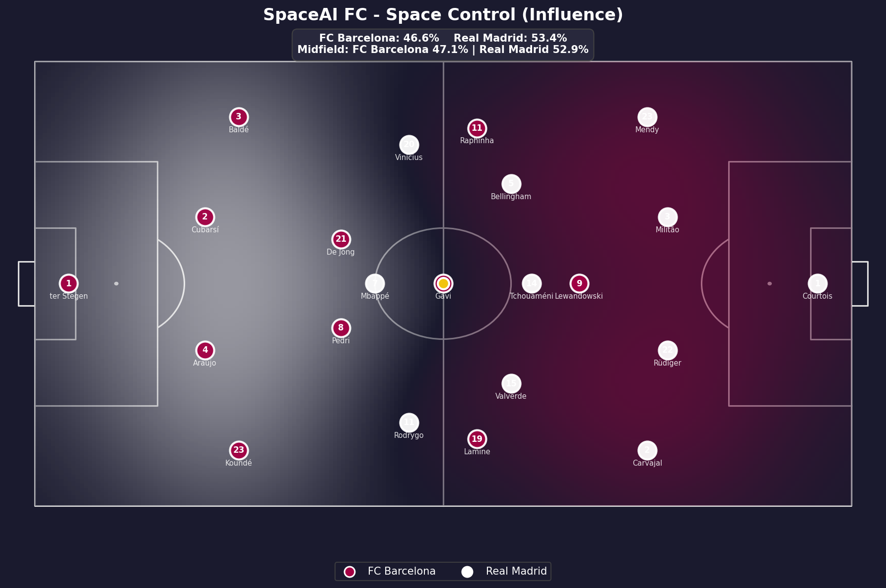
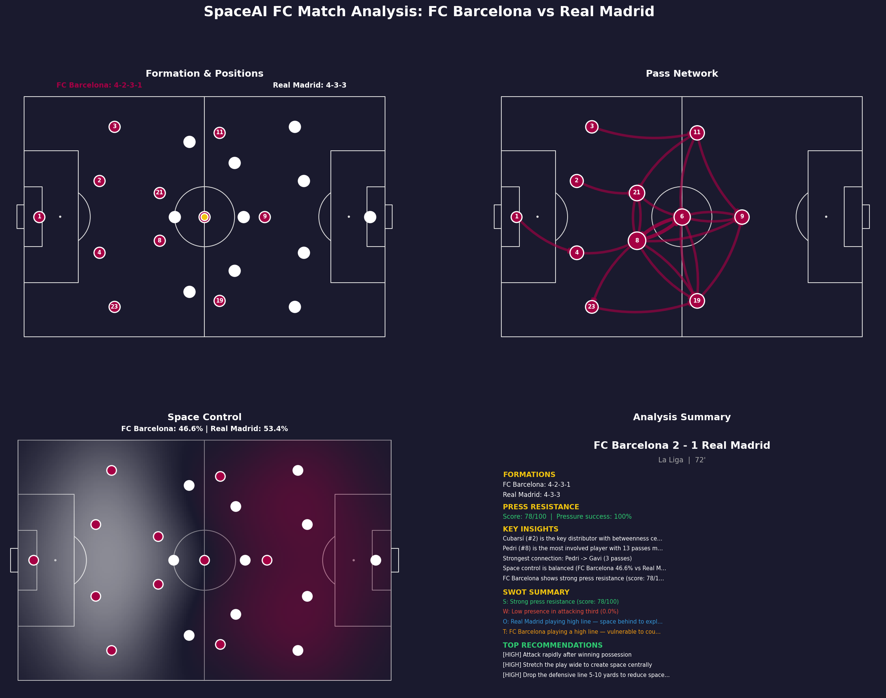

# ⚽ SpaceAI FC

**Agentic Tactical Intelligence System for Football**

An AI-powered football analysis engine **and full-stack web application** that watches matches, understands tactical structure, reasons about strengths and weaknesses, recommends strategies, and explains decisions in natural language. The 4-phase engine is wrapped in a **FastAPI** backend and served through a **Streamlit** frontend with **12 interactive features**, **3 input methods** (manual entry, video upload, dataset upload), and **LLM-powered insights** via OpenRouter. Built with a robotics-inspired pipeline: **Sense → Understand → Reason → Act → Explain**.

---

## 🎯 What It Does

### Engine Capabilities

SpaceAI FC takes match data (player positions, pass events, video clips) and produces:

- **Pitch visualization** with player positions and team separation
- **Pass network analysis** identifying key distributors and strongest connections
- **Pass sequence visualization** showing step-by-step build-up plays
- **Space control maps** using Voronoi and Gaussian influence models
- **Formation detection** using clustering algorithms with confidence scores
- **Player role classification** (false nine, inverted winger, box-to-box, etc.)
- **Press resistance analysis** measuring how well a team handles pressing
- **Tactical pattern detection** (overlaps, compact blocks, wide overloads, high lines, low blocks)
- **Tactical knowledge graph** encoding football knowledge as queryable relationships
- **SWOT tactical reasoning** identifying strengths, weaknesses, opportunities, and threats
- **Strategy recommendations** with prioritized tactical adjustments
- **Natural language explanations** reading like a professional analyst's report
- **Video-based player tracking** extracting positions from match footage
- **Reinforcement learning coach** that learns optimal tactical decisions
- **Multi-agent simulation** testing tactical scenarios before applying them
- **Automated match reports** with Word document export

### Web App Features

The Streamlit frontend exposes **12 interactive features** — each with manual entry, video upload, and dataset upload support:

| # | Feature | Description |
|---|---------|-------------|
| 🏟️ | **Full Match Analysis** | Complete 4-phase pipeline in one click — pitch, passes, space, formations, intelligence |
| 🔗 | **Pass Network** | Directed pass graph with centrality metrics, key distributors, and sequence visualization |
| 🗺️ | **Space Control** | Voronoi and Gaussian influence territorial dominance maps with zone breakdowns |
| 📐 | **Formation Detection** | Clustering-based formation identification with confidence scores and shape overlays |
| 💪 | **Press Resistance** | Press resistance scoring with heatmaps showing vulnerable zones under pressure |
| 🔍 | **Tactical Patterns** | Detection of overlaps, compact blocks, wide overloads, high lines, and low blocks |
| 🎯 | **Strategy Recommendations** | Prioritized tactical adjustments with reasoning and expected impact |
| 👤 | **Player Assessment** | Individual player role classification, tactical profile, and LLM-powered scouting report |
| 💬 | **Ask SpaceAI** | Natural language Q&A about tactics — powered by OpenRouter LLM with knowledge-graph fallback |
| ⚖️ | **Compare** | Side-by-side comparison of two teams or tactical setups with LLM-generated insights |
| 🎮 | **Simulation** | 5v5 / 7v7 multi-agent tactical simulation with animated visualization and tactic comparison |
| 📝 | **Tactical Explanation** | Full natural language match report generated by LLM or template engine |

### Input Methods

| Method | Description |
|--------|-------------|
| ✏️ **Manual Entry** | Enter player positions, pass events, and match info directly in the UI |
| 🎥 **Video Upload** | Upload match video (or YouTube URL) — YOLOv8 extracts player positions automatically |
| 📊 **Dataset Upload** | Upload a CSV or JSON file with pre-collected match data |

---

## 📸 Sample Output

### Pitch Model


### Pass Network


### Build-Up Sequence


### Space Control (Voronoi)


### Space Control (Influence Model)


### Full Match Dashboard


---

## 🏗️ System Architecture

```
Input (positions, passes, stats, video, datasets)
 ↓
┌──────────────────────────────────────────────────┐
│  Streamlit Frontend (port 8501)                  │
│  12 features · 3 input methods · LLM chat        │
└──────────────────┬───────────────────────────────┘
                   ↓ HTTP / JSON
┌──────────────────────────────────────────────────┐
│  FastAPI Backend (port 8000)                     │
│  22 endpoints · rate limiting · CORS · validation │
└──────────────────┬───────────────────────────────┘
                   ↓
┌──────────────────────────────────────────────────┐
│  Engine                                          │
│                                                  │
│  Phase 1 — Foundation (Sense)                    │
│    pitch model, pass networks, space control     │
│                                                  │
│  Phase 2 — Detection (Understand)                │
│    formations, player roles, press resistance,   │
│    tactical patterns                             │
│                                                  │
│  Phase 3 — Intelligence (Reason → Act → Explain) │
│    knowledge graph, SWOT reasoning,              │
│    recommendations, explanations                 │
│                                                  │
│  Phase 4 — Advanced AI (Perceive + Learn + Sim)  │
│    video tracking, RL coach, multi-agent sim     │
└──────────────────────────────────────────────────┘
                   ↓
Output (dashboards, reports, Word docs, animations, images)
```

---

## 📁 Project Structure

```
spaceai-fc/
├── api/                                 # FastAPI backend
│   ├── __init__.py
│   ├── config.py                        # API settings, env vars, constants
│   ├── main.py                          # FastAPI app entry point
│   ├── models/
│   │   ├── __init__.py
│   │   ├── requests.py                  # Pydantic request models
│   │   └── responses.py                 # Pydantic response models
│   ├── routers/
│   │   ├── __init__.py
│   │   ├── analysis.py                  # Full pipeline & tactical analysis
│   │   ├── ask.py                       # Natural language Q&A
│   │   ├── explanation.py               # Tactical explanation generation
│   │   ├── export.py                    # Word/PDF document export
│   │   ├── formation.py                 # Formation detection endpoint
│   │   ├── intelligence.py              # Knowledge graph, reasoning, recs
│   │   ├── pass_network.py              # Pass network endpoint
│   │   ├── patterns.py                  # Tactical pattern endpoint
│   │   ├── press_resistance.py          # Press resistance endpoint
│   │   ├── roles.py                     # Player role classification
│   │   ├── simulation.py               # Tactical simulation & RL
│   │   ├── space_control.py             # Space control endpoint
│   │   └── video.py                     # Video upload & YouTube analysis
│   ├── services/
│   │   ├── __init__.py
│   │   ├── engine_service.py            # Bridge between API and engine
│   │   ├── llm_service.py               # LLM calls (OpenRouter / Anthropic)
│   │   └── video_service.py             # Video processing service
│   └── utils/
│       ├── __init__.py
│       ├── file_handler.py              # File upload handling & validation
│       └── image_encoder.py             # Base64 image encoding for responses
├── app/                                 # Streamlit frontend
│   ├── __init__.py
│   ├── demo_data.py                     # El Clásico demo data (Barça vs Madrid)
│   ├── streamlit_app.py                 # Streamlit entry point
│   ├── components/
│   │   ├── __init__.py
│   │   ├── input_forms.py               # Reusable input widgets (player tables, etc.)
│   │   ├── results_display.py           # Result rendering components
│   │   ├── sidebar.py                   # Navigation sidebar
│   │   └── theme.py                     # Custom CSS theme injection
│   ├── utils/
│   │   ├── __init__.py
│   │   ├── api_client.py                # HTTP client for FastAPI backend
│   │   └── llm_client.py                # OpenRouter LLM client (direct)
│   └── views/
│       ├── __init__.py
│       ├── ask_spaceai.py               # 💬 Ask SpaceAI view
│       ├── compare.py                   # ⚖️ Compare view
│       ├── explanation.py               # 📝 Tactical Explanation view
│       ├── formation.py                 # 📐 Formation Detection view
│       ├── full_analysis.py             # 🏟️ Full Match Analysis view
│       ├── pass_network.py              # 🔗 Pass Network view
│       ├── patterns.py                  # 🔍 Tactical Patterns view
│       ├── player_assessment.py         # 👤 Player Assessment view
│       ├── press_resistance.py          # 💪 Press Resistance view
│       ├── recommendations.py           # 🎯 Strategy Recommendations view
│       ├── simulation.py               # 🎮 Simulation view
│       └── space_control.py             # 🗺️ Space Control view
├── engine/                              # Core analysis engine
│   ├── __init__.py
│   ├── analysis/
│   │   ├── __init__.py
│   │   ├── pass_network.py              # Pass graph analysis & visualization
│   │   ├── space_control.py             # Voronoi & influence space control
│   │   ├── formation_detection.py       # Formation detection with clustering
│   │   ├── role_classifier.py           # Player role classification
│   │   ├── press_resistance.py          # Press resistance analysis
│   │   ├── pattern_detection.py         # Tactical pattern detection
│   │   └── match_report.py              # Combined report & dashboard generator
│   ├── intelligence/
│   │   ├── __init__.py
│   │   ├── knowledge_graph.py           # Football tactical knowledge graph
│   │   ├── tactical_reasoning.py        # SWOT-based tactical reasoning engine
│   │   ├── strategy_recommender.py      # Prioritized strategy recommendations
│   │   ├── explanation_layer.py         # Natural language explanation generator
│   │   ├── rl_coach.py                  # Reinforcement learning tactical coach
│   │   └── simulation.py               # Multi-agent tactical simulation
│   ├── perception/
│   │   ├── __init__.py
│   │   └── video_analyzer.py            # Video-based player tracking & detection
│   └── visualization/
│       ├── __init__.py
│       └── pitch.py                     # Football pitch model & player plotting
├── data/
│   ├── processed/                       # Processed datasets
│   └── raw/                             # Raw data files
├── outputs/                             # Generated images, reports, animations, documents
├── tests/
│   └── __init__.py
├── notebooks/                           # Jupyter notebooks (exploration)
├── temp/                                # Temporary files (video processing, etc.)
├── main.py                              # Engine demo — runs full 4-phase pipeline
├── test_api.py                          # API integration tests
├── requirements.txt                     # Python dependencies
├── .gitignore
├── CLAUDE.md                            # AI assistant context file
└── README.md
```

---

## 🚀 Quick Start

### 1. Clone the repository
```bash
git clone https://github.com/Yassin-Youssef/SpaceAI-fc.git
cd SpaceAI-fc
```

### 2. Create virtual environment
```bash
python -m venv venv
source venv/bin/activate        # Mac/Linux
.\venv\Scripts\Activate         # Windows
```

### 3. Install dependencies
```bash
pip install -r requirements.txt
```

### 4. Install Phase 4 dependencies (optional)
```bash
pip install ultralytics opencv-python yt-dlp    # Video analysis
pip install gymnasium stable-baselines3          # RL coach
```

### 5. Set up LLM (optional — enables Ask SpaceAI, Player Assessment, Compare, Explanation)
```bash
# Get a key from https://openrouter.ai/
export OPENROUTER_API_KEY="sk-or-..."           # Mac/Linux
set OPENROUTER_API_KEY=sk-or-...                # Windows CMD
$env:OPENROUTER_API_KEY="sk-or-..."             # Windows PowerShell
```

### Option A — Run Engine Only
```bash
python main.py
```
Runs the full El Clásico analysis across all 4 phases and saves outputs to `outputs/`.

### Option B — Run Full Web App
```bash
# Terminal 1 — start the API backend
uvicorn api.main:app --reload --port 8000

# Terminal 2 — start the Streamlit frontend
streamlit run app/streamlit_app.py --server.port 8501
```
Open **http://localhost:8501** in your browser.

---

## 🌐 Web App Features

| Feature | Icon | Description | LLM Enhanced |
|---------|------|-------------|:---:|
| Full Match Analysis | 🏟️ | End-to-end pipeline: pitch, passes, space, formations, intelligence, recommendations | — |
| Pass Network | 🔗 | Directed pass graph, centrality metrics, key distributor, sequence visualization | — |
| Space Control | 🗺️ | Voronoi + Gaussian influence maps, zone breakdown, midfield control | — |
| Formation Detection | 📐 | Clustering-based formation identification with confidence scores | — |
| Press Resistance | 💪 | Press resistance scoring (0–100), heatmaps, vulnerable zone detection | — |
| Tactical Patterns | 🔍 | Overlaps, compact blocks, wide overloads, high lines, low blocks | — |
| Strategy Recommendations | 🎯 | Prioritized tactical adjustments with reasoning and expected impact | — |
| Player Assessment | 👤 | Individual role classification, tactical profile, scouting report | ✅ |
| Ask SpaceAI | 💬 | Free-form Q&A about tactics, formations, counter-strategies | ✅ |
| Compare | ⚖️ | Side-by-side team/tactic comparison with AI-generated insights | ✅ |
| Simulation | 🎮 | 5v5 / 7v7 multi-agent tactical simulation, animated visualization | — |
| Tactical Explanation | 📝 | Full natural language match report (LLM or template fallback) | ✅ |

> Features marked **✅** use OpenRouter (Claude) when `OPENROUTER_API_KEY` is set, and fall back to the knowledge-graph template engine when it's not.

---

## 🔧 Engine Modules

### Phase 1 — Foundation (Sense)

#### Pitch Model (`engine/visualization/pitch.py`)
- 2D football pitch rendering using mplsoccer
- Player position plotting with team colors
- Ball position marker
- Configurable pitch dimensions and styles

#### Pass Network (`engine/analysis/pass_network.py`)
- Directed graph of passes between players (NetworkX)
- Centrality metrics: degree, betweenness, eigenvector
- Key distributor identification
- Top connection detection and weak link analysis
- Two visualization modes:
  - **Network view**: overall passing structure with curved arrows
  - **Sequence view**: step-by-step build-up play with numbered passes

#### Space Control (`engine/analysis/space_control.py`)
- **Voronoi model**: nearest-player territorial zones
- **Influence model**: Gaussian decay spatial dominance
- Overall control percentages
- Zone breakdown (defensive / middle / attacking third)
- Midfield control analysis

#### Match Report (`engine/analysis/match_report.py`)
- Combines all analysis modules into one report
- Automated insight generation
- Tactical recommendations
- 4-panel visual dashboard
- Formatted text report
- Word document export (.docx) with phase-separated sections

### Phase 2 — Detection (Understand)

#### Formation Detection (`engine/analysis/formation_detection.py`)
- Clustering-based formation detection (scikit-learn)
- Handles both left-side and right-side teams automatically
- Confidence scores for detected formations
- Formation shape overlay visualization on pitch
- Supports common formations: 4-3-3, 4-2-3-1, 3-5-2, 4-4-2, etc.

#### Player Role Classification (`engine/analysis/role_classifier.py`)
- Rule-based tactical role classification beyond basic positions
- Striker roles: target man, false nine, poacher
- Winger roles: traditional winger, inverted winger, inside forward
- Midfielder roles: box-to-box, deep-lying playmaker, attacking midfielder, defensive midfielder
- Defender roles: overlapping fullback, inverted fullback, ball-playing CB
- Confidence scores and reasoning text for each classification
- Pitch visualization with role labels

#### Press Resistance (`engine/analysis/press_resistance.py`)
- Press resistance score (0-100)
- Pass success rate under pressure
- Escape rate measurement
- Vulnerable zone detection
- Heatmap visualization showing resistance strength across the pitch

#### Tactical Pattern Detection (`engine/analysis/pattern_detection.py`)
- **Overlapping runs**: fullback pushing ahead of winger
- **Compact block**: team compactness via convex hull and inter-player distance
- **Wide overload**: numerical superiority in wide zones
- **High line**: defensive line pushed high up the pitch
- **Low block**: team sitting deep in defensive shape
- Confidence scores and involved player identification
- Visual overlays highlighting detected patterns on pitch

### Phase 3 — Tactical Intelligence (Reason → Act → Explain)

#### Football Knowledge Graph (`engine/intelligence/knowledge_graph.py`)
- NetworkX-based graph encoding tactical knowledge
- Node types: Formations, Situations, Strategies, Weaknesses
- 30+ edges covering tactical relationships
- Query methods: counter-strategies, formation weaknesses/strengths, exploitation strategies
- Color-coded knowledge graph visualization

#### Tactical Reasoning Engine (`engine/intelligence/tactical_reasoning.py`)
- SWOT-based analysis (Strengths, Weaknesses, Opportunities, Threats)
- 15+ rule-based reasoning rules
- Integrates results from all Phase 1 and 2 modules
- Queries the knowledge graph for counter-strategies
- Detects tactical situations and maps them to responses

#### Strategy Recommender (`engine/intelligence/strategy_recommender.py`)
- Prioritized recommendations (High / Medium / Low)
- Categories: formation changes, pressing adjustments, attacking strategies, defensive adjustments, player instructions
- Each recommendation includes reasoning and expected impact
- Connects pass network data to player-specific instructions

#### Explanation Layer (`engine/intelligence/explanation_layer.py`)
- **Template mode**: generates professional tactical analysis using string templates (no API needed)
- **LLM mode** (optional): uses OpenRouter or Anthropic API for richer natural language explanations
- Produces multi-paragraph analysis covering: what's happening, why it matters, what should change
- Falls back to template mode if no API key is available

### Phase 4 — Advanced AI (Perceive + Learn + Simulate)

#### Video Analyzer (`engine/perception/video_analyzer.py`)
- YOLOv8 person detection on video frames
- Player tracking across frames maintaining identity
- Homography transformation (camera view → pitch coordinates)
- Team separation via jersey color detection (HSV)
- Individual player tracking: movement trajectory, heatmap, distance covered, speed
- Synthetic demo mode for testing without real video files
- Output in same format as rest of engine for seamless integration

#### RL Coach (`engine/intelligence/rl_coach.py`)
- Custom Gymnasium environment simulating match tactical decisions
- State space: formation, space control, press resistance, score, minute, possession
- Action space: 9 tactical decisions (press higher, drop deeper, exploit width, etc.)
- PPO training with Stable-Baselines3 (configurable timesteps)
- Evaluation showing decision patterns, win rates, and scenario-specific preferences
- Save/load trained models

#### Multi-Agent Simulation (`engine/intelligence/simulation.py`)
- 5v5 simplified tactical simulation on 2D pitch
- Rule-based agent behaviors: attackers, midfielders, defenders, goalkeeper
- Tactical presets: high press vs low block, wide play vs narrow play, counter-attack vs possession
- Comparison mode running multiple simulations and comparing outcomes
- Animated visualization (GIF export)
- Statistics: goals, possession, territorial control

---

## 🗺️ Roadmap

### Engine

#### Phase 1 — Foundation ✅
- [x] Pitch model & player plotting
- [x] Pass network analysis (network view + sequence view)
- [x] Space control (Voronoi + Influence)
- [x] Match report generator with Word export
- [x] Visual dashboard

#### Phase 2 — Detection ✅
- [x] Formation detection with clustering algorithms
- [x] Player role classification
- [x] Press resistance analysis
- [x] Tactical pattern detection (overlaps, compact blocks, overloads, high line, low block)

#### Phase 3 — Tactical Intelligence ✅
- [x] Football knowledge graph (30+ tactical relationships)
- [x] Rule-based tactical reasoning (SWOT analysis)
- [x] Strategy recommendation system (prioritized adjustments)
- [x] Explanation layer (template mode + optional LLM mode)

#### Phase 4 — Advanced AI ✅
- [x] Video-based player tracking (YOLOv8 + synthetic demo)
- [x] Reinforcement learning coach (PPO)
- [x] Multi-agent simulation (5v5 tactical testing)

### Product

- [x] FastAPI backend (22 endpoints, rate limiting, CORS, validation)
- [x] Streamlit MVP (12 features, 3 input methods, LLM integration)
- [ ] Production frontend (React + Tailwind + Supabase)
- [ ] Deployment (Vercel / cloud hosting)

---

## 🛠️ Tech Stack

| Tool | Purpose |
|------|---------|
| Python | Core language |
| NumPy / Pandas | Numerical computing & data processing |
| NetworkX | Pass analysis + knowledge graph |
| SciPy | Voronoi tessellation, spatial analysis |
| scikit-learn | Formation clustering |
| matplotlib / mplsoccer | Visualization & pitch rendering |
| python-docx | Word document export |
| **FastAPI** | **REST API backend** |
| **Uvicorn** | **ASGI server** |
| **Streamlit** | **Interactive frontend** |
| **OpenRouter API** | **LLM-powered insights (Claude)** |
| slowapi | API rate limiting |
| httpx / requests | HTTP clients |
| Pillow | Image processing |
| YOLOv8 (Ultralytics) | Player detection from video |
| OpenCV | Video processing |
| Gymnasium + Stable-Baselines3 | Reinforcement learning |

---

## 💡 Inspired By

The system follows a robotics-inspired agentic pipeline:

**Sense → Understand → Reason → Act → Explain**

Designed to function like an intelligent football analyst that observes matches, understands structure, reasons about tactics, recommends strategies, and explains decisions.

---

## 📄 License

MIT License

---

*Built by Yassin Youssef*