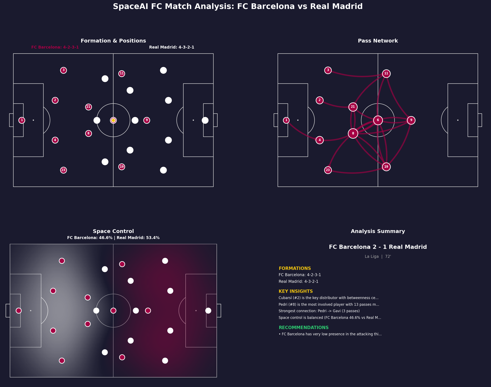

# ⚽ SpaceAI FC

**Agentic Tactical Intelligence System for Football**

An AI-powered football analysis engine that understands player positioning, analyzes space control and passing dynamics, detects formations and tactical patterns, classifies player roles, and generates strategic insights. Built with a robotics-inspired pipeline: **Sense → Understand → Reason → Act → Explain**.

---

## 🎯 What It Does

SpaceAI FC takes match data (player positions, pass events) and produces:

- **Pitch visualization** with player positions and team separation
- **Pass network analysis** identifying key distributors and strongest connections
- **Pass sequence visualization** showing step-by-step build-up plays
- **Space control maps** using Voronoi and Gaussian influence models
- **Formation detection** using clustering algorithms with confidence scores
- **Player role classification** (false nine, inverted winger, box-to-box, etc.)
- **Press resistance analysis** measuring how well a team handles pressing
- **Tactical pattern detection** (overlaps, compact blocks, wide overloads, high lines, low blocks)
- **Automated match reports** with tactical insights, recommendations, and Word document export

---

## 📸 Sample Output

### Pitch Model


### Pass Network


### Build-Up Sequence


### Space Control (Voronoi)


### Space Control (Influence Model)


### Full Match Dashboard


---

## 🏗️ System Architecture

```
Input (positions, passes, stats)
        ↓
   Perception
   (player positions, coordinate mapping)
        ↓
   Detection
   (formations, player roles, tactical patterns)
        ↓
   Tactical Analysis
   (space control, pass networks, press resistance)
        ↓
   Match Report
   (insights, recommendations, visualizations)
        ↓
   Output
   (dashboards, reports, Word documents, images)
```

---

## 📁 Project Structure

```
spaceai-fc/
├── engine/
│   ├── analysis/
│   │   ├── pass_network.py          # Pass graph analysis & visualization
│   │   ├── space_control.py         # Voronoi & influence space control
│   │   ├── formation_detection.py   # Formation detection with clustering
│   │   ├── role_classifier.py       # Player role classification
│   │   ├── press_resistance.py      # Press resistance analysis
│   │   ├── pattern_detection.py     # Tactical pattern detection
│   │   └── match_report.py          # Combined report & dashboard generator
│   ├── intelligence/                # Phase 3: tactical reasoning (coming soon)
│   ├── perception/                  # Future: video-based perception
│   └── visualization/
│       └── pitch.py                 # Football pitch model & player plotting
├── outputs/                         # Generated images, reports, and documents
├── tests/                           # Unit tests
├── main.py                          # Full demo - runs entire pipeline
├── requirements.txt                 # Python dependencies
└── README.md
```

---

## 🚀 Quick Start

### 1. Clone the repository
```bash
git clone https://github.com/Yassin-Youssef/SpaceAI-fc.git
cd SpaceAI-fc
```

### 2. Create virtual environment
```bash
python -m venv venv
source venv/bin/activate        # Mac/Linux
.\venv\Scripts\Activate         # Windows
```

### 3. Install dependencies
```bash
pip install -r requirements.txt
```

### 4. Run the demo
```bash
python main.py
```

This runs the full El Clásico analysis and saves all outputs to the `outputs/` folder.

---

## 🔧 Engine Modules

### Phase 1 — Foundation

#### Pitch Model (`engine/visualization/pitch.py`)
- 2D football pitch rendering using mplsoccer
- Player position plotting with team colors
- Ball position marker
- Configurable pitch dimensions and styles

#### Pass Network (`engine/analysis/pass_network.py`)
- Directed graph of passes between players (NetworkX)
- Centrality metrics: degree, betweenness, eigenvector
- Key distributor identification
- Top connection detection and weak link analysis
- Two visualization modes:
  - **Network view**: overall passing structure with curved arrows
  - **Sequence view**: step-by-step build-up play with numbered passes

#### Space Control (`engine/analysis/space_control.py`)
- **Voronoi model**: nearest-player territorial zones
- **Influence model**: Gaussian decay spatial dominance
- Overall control percentages
- Zone breakdown (defensive / middle / attacking third)
- Midfield control analysis

#### Match Report (`engine/analysis/match_report.py`)
- Combines all analysis modules into one report
- Automated insight generation
- Tactical recommendations
- 4-panel visual dashboard
- Formatted text report
- Word document export (.docx)

### Phase 2 — Detection

#### Formation Detection (`engine/analysis/formation_detection.py`)
- Clustering-based formation detection (scikit-learn)
- Handles both left-side and right-side teams automatically
- Confidence scores for detected formations
- Formation shape overlay visualization on pitch
- Supports common formations: 4-3-3, 4-2-3-1, 3-5-2, 4-4-2, etc.

#### Player Role Classification (`engine/analysis/role_classifier.py`)
- Rule-based tactical role classification beyond basic positions
- Striker roles: target man, false nine, poacher
- Winger roles: traditional winger, inverted winger, inside forward
- Midfielder roles: box-to-box, deep-lying playmaker, attacking midfielder, defensive midfielder
- Defender roles: overlapping fullback, inverted fullback, ball-playing CB
- Confidence scores and reasoning text for each classification
- Pitch visualization with role labels

#### Press Resistance (`engine/analysis/press_resistance.py`)
- Press resistance score (0-100)
- Pass success rate under pressure
- Escape rate measurement
- Vulnerable zone detection
- Heatmap visualization showing resistance strength across the pitch

#### Tactical Pattern Detection (`engine/analysis/pattern_detection.py`)
- **Overlapping runs**: fullback pushing ahead of winger
- **Compact block**: team compactness via convex hull and inter-player distance
- **Wide overload**: numerical superiority in wide zones
- **High line**: defensive line pushed high up the pitch
- **Low block**: team sitting deep in defensive shape
- Confidence scores and involved player identification
- Visual overlays highlighting detected patterns on pitch

---

## 🗺️ Roadmap

### Phase 1 — Foundation ✅
- [x] Pitch model & player plotting
- [x] Pass network analysis (network view + sequence view)
- [x] Space control (Voronoi + Influence)
- [x] Match report generator with Word export
- [x] Visual dashboard

### Phase 2 — Detection ✅
- [x] Formation detection with clustering algorithms
- [x] Player role classification
- [x] Press resistance analysis
- [x] Tactical pattern detection (overlaps, compact blocks, overloads, high line, low block)

### Phase 3 — Tactical Intelligence (Next)
- [ ] Football knowledge graph
- [ ] Rule-based tactical reasoning
- [ ] Strategy recommendation system
- [ ] LLM explanation layer

### Phase 4 — Advanced AI
- [ ] Video-based player tracking
- [ ] Reinforcement learning coach
- [ ] Multi-agent simulation

---

## 🛠️ Tech Stack

| Tool | Purpose |
|------|---------|
| Python | Core language |
| NumPy | Numerical computing |
| Pandas | Data processing |
| NetworkX | Graph-based pass analysis |
| SciPy | Voronoi tessellation, spatial analysis |
| scikit-learn | Formation clustering |
| matplotlib | Visualization engine |
| mplsoccer | Football-specific pitch rendering |
| python-docx | Word document report export |

---

## 💡 Inspired By

The system follows a robotics-inspired agentic pipeline:

**Sense → Understand → Reason → Act → Explain**

Designed to function like an intelligent football analyst that observes matches, understands structure, reasons about tactics, recommends strategies, and explains decisions.

---

## 📄 License

MIT License

---

*Built by Yassin Youssef*